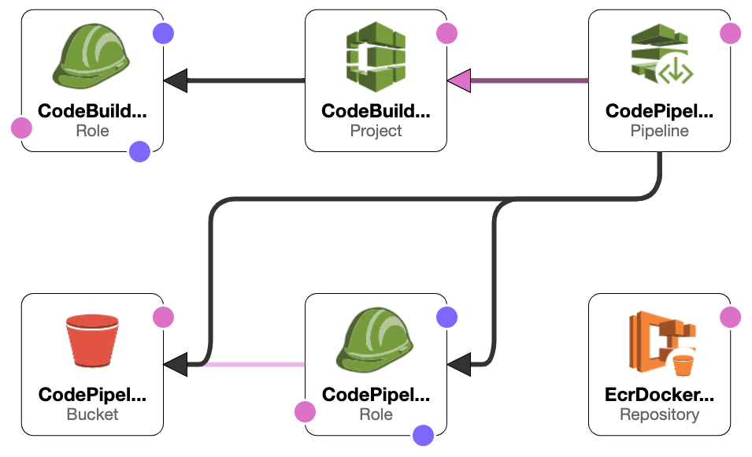

# eks-sample-app

## resources Created with terraform


1. Backend s3 - for remote state
2. VPC
3. Internet Gateway (IGW)
4. Public and Private Subnets
5. Security Groups, Route Tables and Route Table Associations
6. IAM roles, instance profiles and policies
7. An EKS Cluster
8. EKS Managed Node group
9. Autoscaling group and Launch Configuration
10. Worker Nodes in a private Subnet
11. bastion host for ssh access to the VPC
12. The ConfigMap required to register Nodes with EKS
13. KUBECONFIG file to authenticate kubectl using the `aws eks get-token` command 


## Resources created using Cloud Formation



1. CodePipelineGitHub
2. Codepipeline
3. EcrDockerRepository
4. CodeBuildServiceRole
5. CodePipelineServiceRole
6. CodePipelineArtifactBucket

## Install 
1. Export the `export ACCOUNT_ID=<Account ID>>` 
2. Execute the [codepipeline.sh](codepipeline.sh) from the root of the project. it will build up the entire infra. 


[buildspec.yaml.](buildspec.yaml) has the code build pipe actions to be executed on the every commit in the main branch of the repo. 
I Used a simple go api application which will return a text response deployed as K8s workload in the created cluster. 

###Things can be improved:
1. Auto Scaling based on based metrics. 
2. Encrypted communication with Let's encrypt or any other CA.
3. and list will go on as in when required. 

## Destroy

Execute [destroy.sh](nuke/destroy.sh) script to nuke out the entire infra. 
Then execute this command to destroy the state. 
<strong>
Caution: execute this only if the above script executed successfully
</strong> 

```shell
aws s3 rm s3://tf-state-cluster --recursive
```


Credits: This application was build with reference to this [repo](https://github.com/rnzsgh/eks-workshop-sample-api-service-go).


